# 🍽️ Yummy Restaurant Web & API Projesi

🎉 ASP.NET Core 6.0 tabanlı **tam fonksiyonel restoran yönetim ve tanıtım sistemi** geliştirdim.  
Bu proje, **Web UI + Web API + Admin Dashboard** yapısını tek bir çözüm altında birleştirerek, gerçek hayatta kullanılabilecek modern bir restoran uygulaması sunmaktadır.

Proje; **kullanıcı tarafı (UI)**, **yönetim paneli (Dashboard)** ve **MSSQL destekli API altyapısı** ile uçtan uca tamamlanmıştır.

---

## 🚀 Proje Genel Özellikleri

- ASP.NET Core 6.0 Web API mimarisi  
- Modern ve responsive Web UI  
- Admin Dashboard (CRUD + istatistikler)  
- MSSQL Server & Entity Framework Core  
- Code First + Migration desteği  
- Swagger ile API dokümantasyonu  
- Google Maps entegrasyonu  
- Rezervasyon & iletişim yönetimi  
- Dashboard grafik & chart yapıları  

---

## 🧩 Proje Mimarisi

Asp.NetCore6.0_Yummy_API_Project

│
├── YummyApi.WebApi → RESTful API katmanı

├── YummyApi.WebUI → Kullanıcı arayüzü (UI)

├── docs/screenshots → README ekran görüntüleri

└── Asp.NetCore6.0_Yummy_API_Project.sln

---

## 🌐 Web UI (Kullanıcı Tarafı)

Kullanıcıların restoran hakkında bilgi alabileceği ve etkileşim kurabileceği modern arayüz:

### 🔹 Özellikler
- Ana Sayfa
- Hakkımızda
- Menü (kategori bazlı ürün listeleme)
- Etkinlikler
- Şefler
- Galeri
- Rezervasyon Formu
- İletişim Sayfası
- Google Maps konum entegrasyonu
- Müşteri yorumları
- Responsive tasarım (mobil & desktop)

---

## 🛠️ Admin Dashboard (Yönetim Paneli)

Admin paneli üzerinden sistemin tüm içeriği yönetilebilir:

- Ürün / Menü Yönetimi
- Kategori Yönetimi
- Rezervasyon Yönetimi
- Mesaj Yönetimi
- Şef Yönetimi
- Dashboard istatistikleri
- Grafik & chart ekranları
- DTO – Entity mapping işlemleri

---

## 🔎 Web API & Swagger

API katmanı Swagger ile test edilebilir ve dokümante edilmiştir.

Örnek Swagger adresi:


---

## 🌐 Web UI (Kullanıcı Tarafı)

Kullanıcıların restoran hakkında bilgi alabileceği ve etkileşim kurabileceği modern arayüz:

### 🔹 Özellikler
- Ana Sayfa
- Hakkımızda
- Menü (kategori bazlı ürün listeleme)
- Etkinlikler
- Şefler
- Galeri
- Rezervasyon Formu
- İletişim Sayfası
- Google Maps konum entegrasyonu
- Müşteri yorumları
- Responsive tasarım (mobil & desktop)

---

## 🛠️ Admin Dashboard (Yönetim Paneli)

Admin paneli üzerinden sistemin tüm içeriği yönetilebilir:

- Ürün / Menü Yönetimi
- Kategori Yönetimi
- Rezervasyon Yönetimi
- Mesaj Yönetimi
- Şef Yönetimi
- Dashboard istatistikleri
- Grafik & chart ekranları
- DTO – Entity mapping işlemleri

---

## 🔎 Web API & Swagger

API katmanı Swagger ile test edilebilir ve dokümante edilmiştir.

Örnek Swagger adresi:

---

## 🌐 Web UI (Kullanıcı Tarafı)

Kullanıcıların restoran hakkında bilgi alabileceği ve etkileşim kurabileceği modern arayüz:

### 🔹 Özellikler
- Ana Sayfa
- Hakkımızda
- Menü (kategori bazlı ürün listeleme)
- Etkinlikler
- Şefler
- Galeri
- Rezervasyon Formu
- İletişim Sayfası
- Google Maps konum entegrasyonu
- Müşteri yorumları
- Responsive tasarım (mobil & desktop)

---

## 🛠️ Admin Dashboard (Yönetim Paneli)

Admin paneli üzerinden sistemin tüm içeriği yönetilebilir:

- Ürün / Menü Yönetimi
- Kategori Yönetimi
- Rezervasyon Yönetimi
- Mesaj Yönetimi
- Şef Yönetimi
- Dashboard istatistikleri
- Grafik & chart ekranları
- DTO – Entity mapping işlemleri

---

## 🔎 Web API & Swagger

API katmanı Swagger ile test edilebilir ve dokümante edilmiştir.

Örnek Swagger adresi:
https://localhost:xxxx/swagger


Swagger üzerinden:
- Endpoint testleri
- Request / Response inceleme
- DTO yapılarının görüntülenmesi mümkündür.

---

## 🗄️ Veritabanı

- **MSSQL Server**
- Entity Framework Core
- Code First yaklaşımı
- Migration desteği

Örnek veritabanı adı:
ApiYummyDB

---

## 🖼️ Ekran Görüntüleri

### 🌐 Web UI

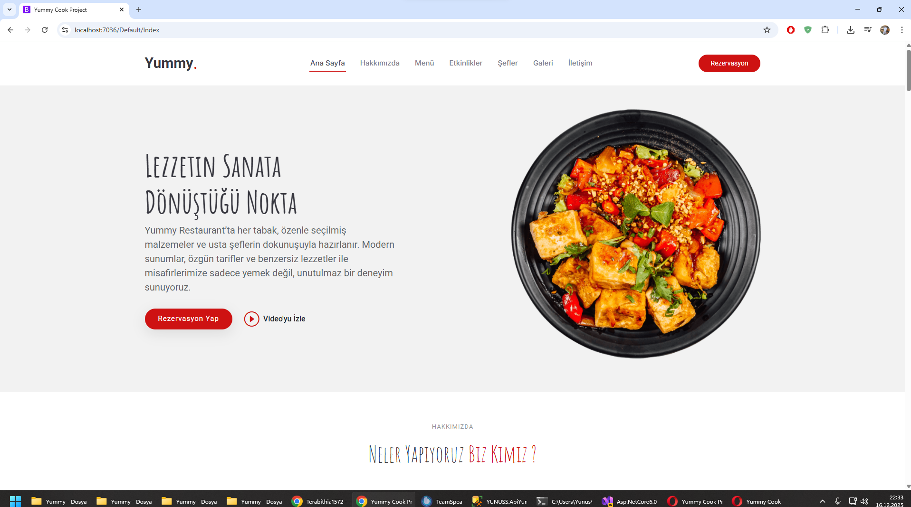
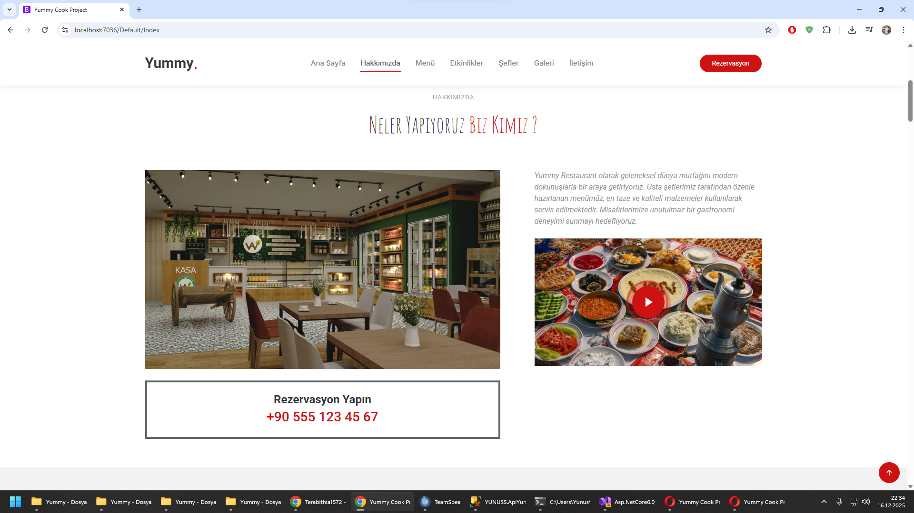
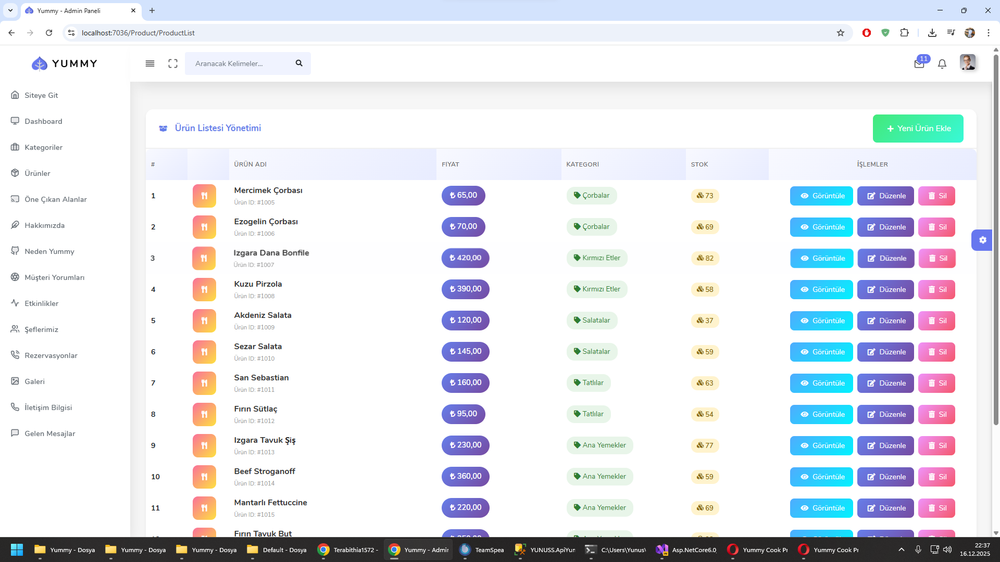
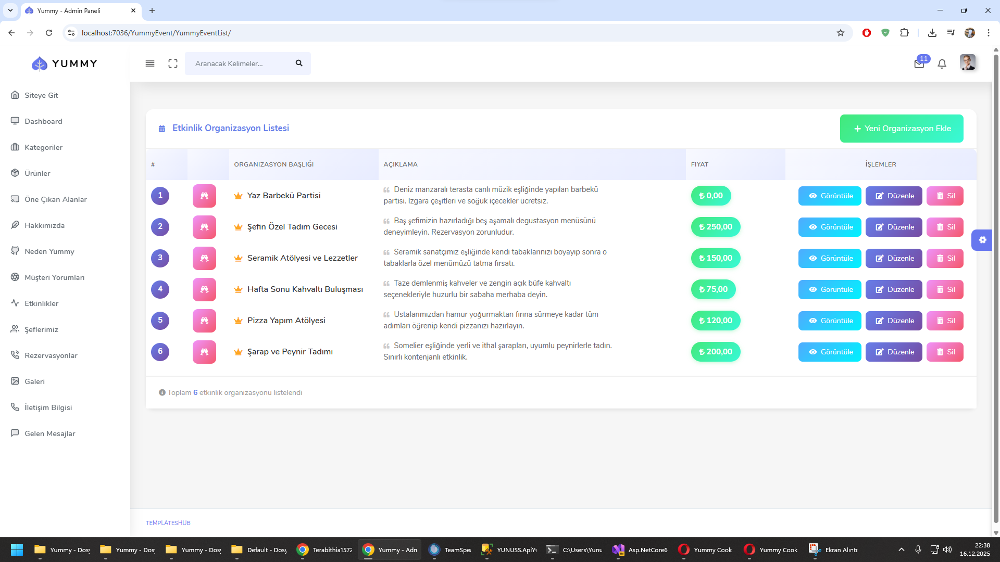

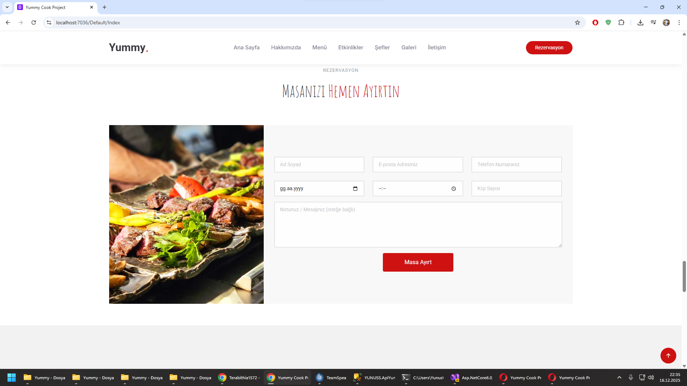
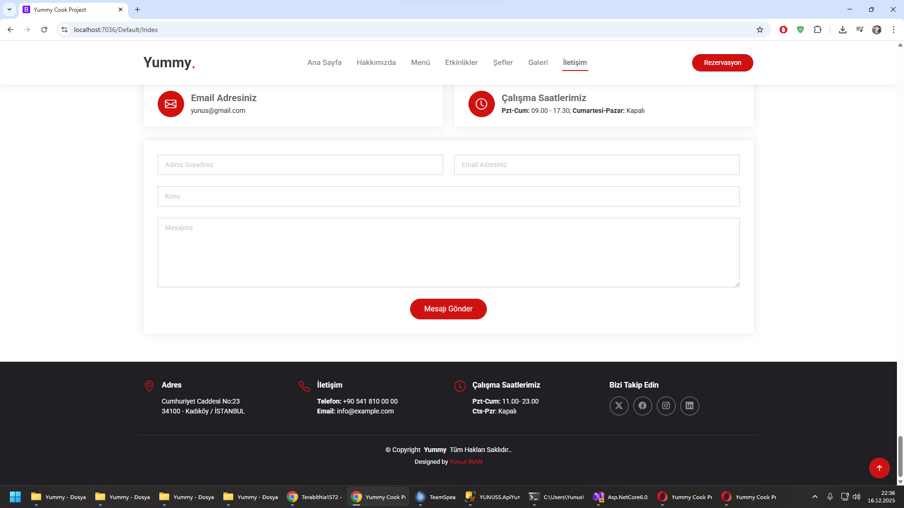
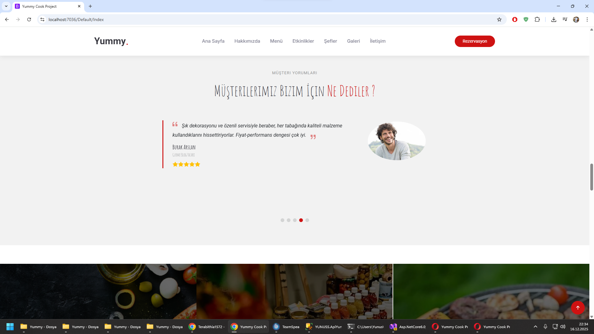

### 🛠️ Admin Dashboard

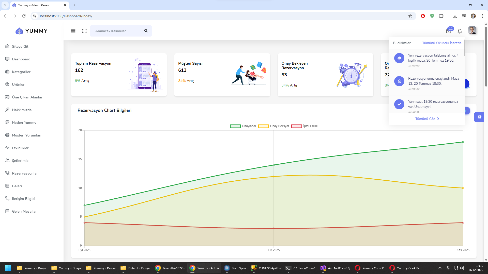
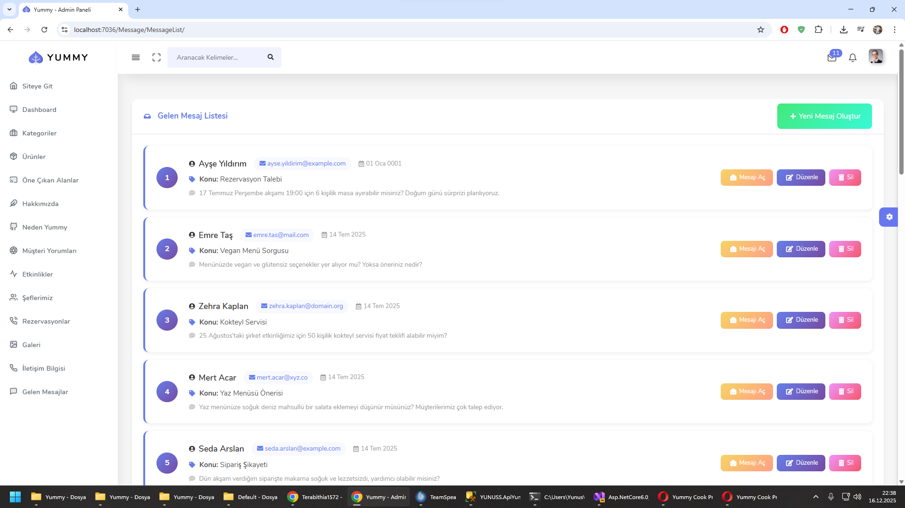

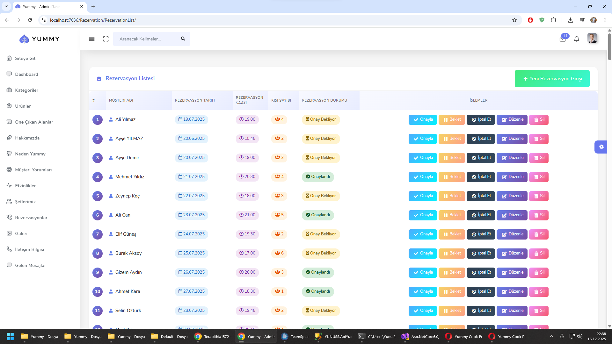
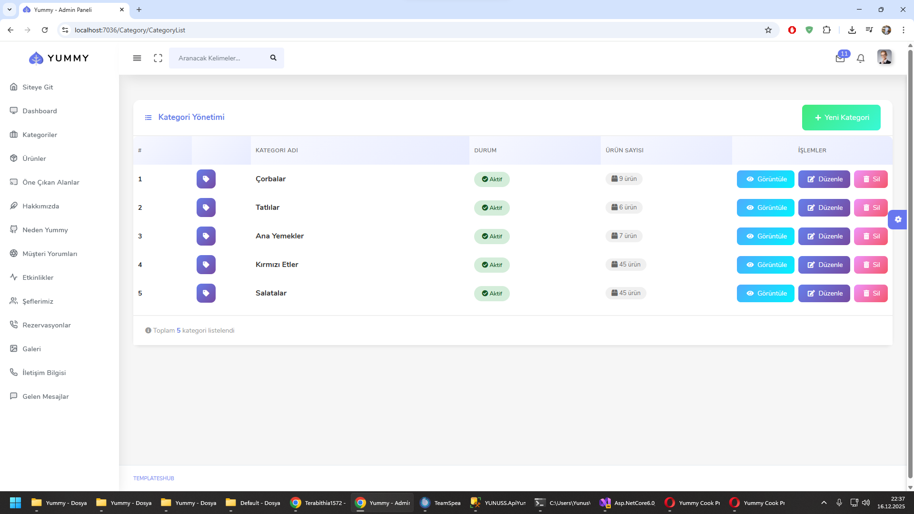
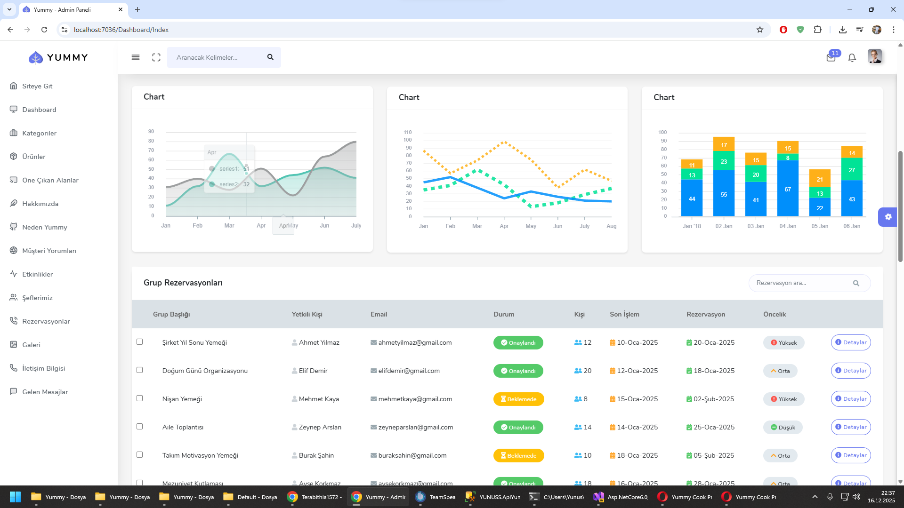
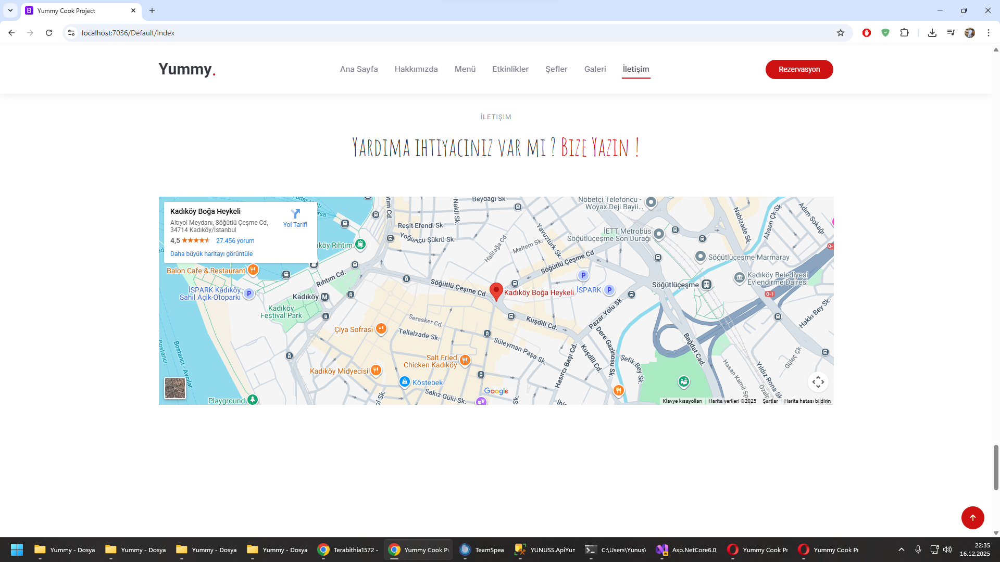

---

## ⚙️ Kurulum (Local)

### 1️⃣ Projeyi Klonla
```bash
git clone https://github.com/Terabithia1572/Asp.NetCore6.0_Yummy_API_Project.git
cd Asp.NetCore6.0_Yummy_API_Project
2️⃣ Paketleri Yükle
dotnet restore
3️⃣ Connection String Ayarı

YummyApi.WebApi/appsettings.json


{
  "ConnectionStrings": {
    "DefaultConnection": "Server=.;Database=ApiYummyDB;Trusted_Connection=True;TrustServerCertificate=True;"
  }
}

4️⃣ Migration & Database
dotnet ef database update --project YummyApi.WebApi

5️⃣ Çalıştırma
dotnet run --project YummyApi.WebApi
dotnet run --project YummyApi.WebUI

🎯 Proje Amacı

Bu proje ile:

ASP.NET Core 6 Web API MSSQL & EF Core  Admin Dashboard geliştirme Gerçek hayat restoran senaryosu üzerinde pratik, üretim odaklı ve portföy niteliğinde bir uygulama geliştirilmiştir.

🔗 Kaynak Kod

🔗 GitHub Repository
https://github.com/Terabithia1572/Asp.NetCore6.0_Yummy_API_Project

🏷️ Etiketler

#DotNet #AspNetCore #WebAPI #MSSQL #EntityFramework #Dashboard
#RestaurantApp #FullStackDeveloper #CSharp #SoftwareDevelopment
#LearningByDoing #PortfolioProject #WebUI #AdminPanel

<p align="center"> <sub> 🚀 Developed by <strong>Yunus İNAN</strong> • <a href="https://github.com/Terabithia1572">GitHub</a> </sub> </p> ```


